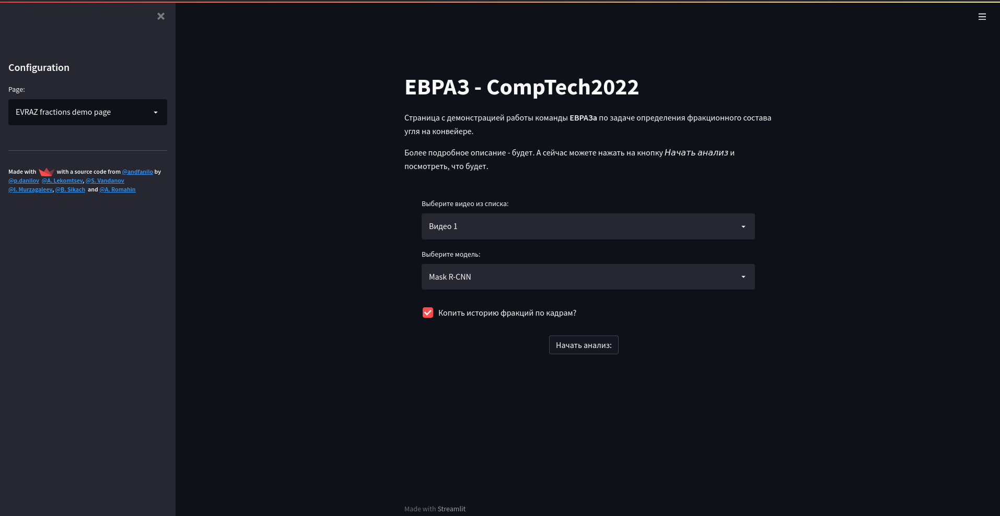
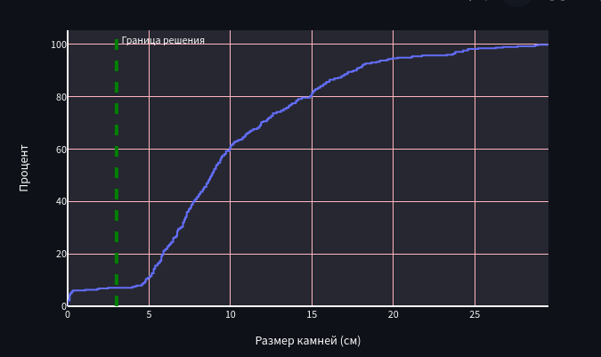
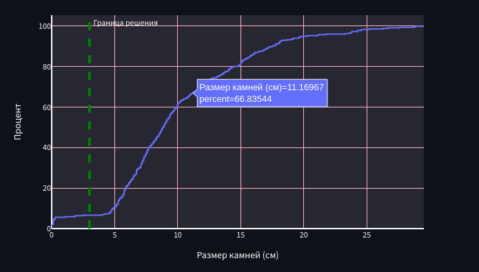

# 1. Introduction

This is a detailed description of a demo interface.

# 2. Getting Started

Provided you've successfully connected to the demo host, you should see the following page:

## 2.1 Page Selection

The _EVRAZ fractions demo page_ option in the _page_ combobox must be selected:

## 2.2 Configuration

### 2.2.1 Video Selection

To choose a video to be processed interract with the _video_ combobox:

### 2.2.2 Model Selection

To choose a model to be used in the inference stage interract with the _model_ combobox:

### 2.2.3 Mode Selection

There are two analysis modes available:

- Single frame
- Video

_Single frame_ mode means that the histogram is being cleared every time a new frame comes.
_Video_ mode means that the histogram is not cleared during the whole video accumulating the results.

To select either mode use the _mode_ checkbox (checked means _video_):

## 2.3 Processing

After you've done with the configuration stage you can start video processing by clicking the _start_ button:

After that you should see new 2 subwindows:

- Processed video window
- Histogram window

### 2.3.1 Processed Video Window

This window plays the selected video (see [Video Selection](#2.2.1-video-selection)) with the results of the object detection
algorithm added:

### 2.3.2 Histogram

This window displays CDF (cumulative distribution function) of the size of the detected coal pieces:

Hover the mouse cursor over the histogram to display the details:

